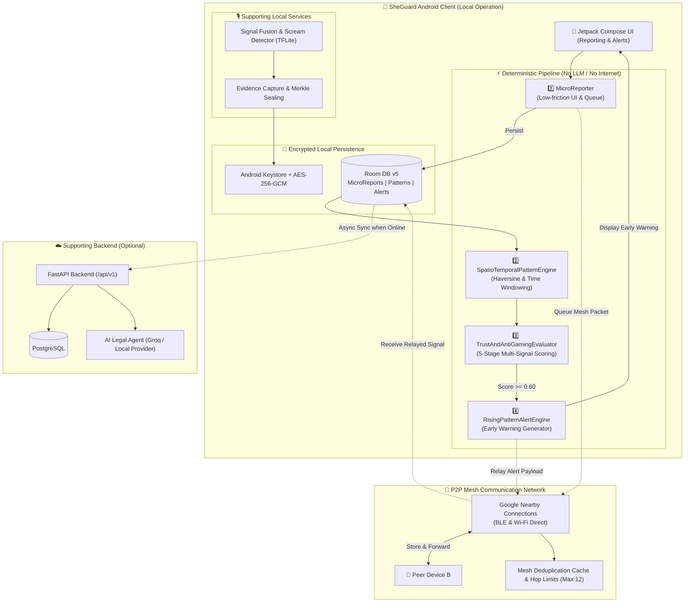

# SheGuard — Offline-First Community Safety & Early Warning System

> **Team Aegis** | **Problem Statement Identifier:** CX1001
> **Domain:** Women Safety & Social Impact — Preventive & Community Safety
> **Canonical Specifications:** `architecture.yaml` | `docs/SHEGUARD_PRD.md`

---
prototype video link : 
https://youtu.be/aliJ3QIUUYE?si=KzZkwFEaYftFlAyW
---
## 🛡️ Executive Summary

**SheGuard** is an offline-first intelligent safety companion and early warning system designed to protect individuals in high-risk, low-connectivity, or urban environments. By converting low-friction, anonymous micro-reports into verified spatio-temporal risk patterns and actionable community-level early warnings, SheGuard empowers communities without depending on continuous cloud connectivity, mobile data networks, or LLMs in the critical safety path.

SheGuard operates on a **3-Tiered Hierarchy**:
1. **Local Operation (Fundamental Guarantee):** Local report creation, Room database persistence, on-device spatio-temporal pattern clustering, multi-signal trust scoring, and early warning alert generation function 100% offline.
2. **Mesh Communication (MVP Capability):** Peer-to-peer relay via Google Nearby Connections (BLE / Wi-Fi Direct) propagates compact safety reports and pattern signals across nearby disconnected devices using store-and-forward semantics.
3. **Backend Synchronization (Supporting Capability):** Asynchronous metadata sync and AI legal complaint drafting take place when internet connectivity is restored.

---

## 📐 Architecture Overview

SheGuard strictly separates the core deterministic safety path from online supporting capabilities. Below is the end-to-end architecture diagram:



---

## 🌟 Key Features (Global → Local Breakdown)

### 1. Global & Community Level Features
- **Deterministic Spatio-Temporal Hazard Clustering:** Aggregates anonymous hazard reports in real-time across spatial radii (100m–1km) and temporal windows (30m–2h) to detect emerging localized danger zones before incidents escalate.
- **Peer-to-Peer Safety Mesh Network:** Extends safety coverage into dead-zones, crowded rallies, or transit routes by propagating compact reports and alerts via BLE and Wi-Fi Direct across participating peer devices.
- **Anti-Gaming Early Warning Network:** Protects against false alarms, spam, and coordinated mobbing through a strict multi-signal verification engine requiring reporter diversity and temporal independence.

### 2. Device & Local Application Level Features
- **Low-Friction Anonymous Micro-Reporting (`MicroReporter`):** Enables users to log hazards (e.g., poor lighting, harassment, suspicious activity, feeling followed) with 1-tap simplicity, coarse location precision (~1km), and no personal identifying information (PII).
- **Multi-Signal Trust Scoring (`TrustAndAntiGamingEvaluator`):** Implements a 5-stage deterministic evaluation pipeline:
  1. *Reporter Diversity:* Evaluates unique anonymous reporter tokens.
  2. *Temporal Independence:* Checks timestamps across independent windows.
  3. *Spatial Consistency:* Verifies spatial clustering tolerances.
  4. *Duplicate Filtering:* Suppresses repetitive payloads.
  5. *Rate/Flood Resistance:* Prevents device spamming.
- **Actionable Rising-Pattern Early Warning (`RisingPatternAlertEngine`):** Surfaces emerald/amber early-warning cards complete with hazard category, approximate radius, risk score, trust badge (HIGH/MEDIUM/LOW), and mandatory non-emergency disclaimers.
- **Tamper-Evident Evidence Vault (`EvidenceCaptureEngine`):** Captures pre-roll audio, encrypts payload using AES-256-GCM backed by hardware Android Keystore, and generates Merkle tree cryptographic seal hashes for legal chain of custody.
- **On-Device Sensor Fusion & Scream Detection:** Runs local TFLite audio classifiers and accelerometer gesture monitoring to trigger automated distress logging without network dependency.

### 3. Backend & Extended Services
- **Asynchronous Incident Synchronization:** Batch-synchronizes non-sensitive metadata and aggregated pattern states when internet connectivity returns.
- **AI Legal Complaint Drafting Agent (`LegalAgent`):** Translates structured incident logs into formal FIR / legal complaint drafts using LLM provider abstractions (Groq / Local model) with explicit legal review disclaimers.

---

## 🏛️ Architectural Decision Records (ADRs) & Why They Exist

| Decision | Architecture / Design Choice | Rationale & Safety Justification ("Why It Exists") |
| :--- | :--- | :--- |
| **ADR-0001** | **Offline-First 3-Tier Hierarchy** | Emergency situations, subterranean transit, or remote areas frequently suffer from total network loss. Personal safety must never depend on cell towers or cloud servers. |
| **ADR-0002** | **No LLMs in Critical Safety Path** | LLMs are non-deterministic, network-dependent, prone to hallucinations, and introduce high latency. Core micro-reporting, pattern detection, trust scoring, and alerting use pure deterministic Kotlin code. |
| **ADR-0003** | **Anti-Gaming Invariant (Diversity over Volume)** | Raw report volume alone **MUST NOT** escalate pattern confidence or trigger alerts. This rule prevents malicious actors from spamming false reports to trigger public panic or misdirect security resources. |
| **ADR-0004** | **Store-and-Forward Mesh with Hop Limits** | Peer devices forward compact packets via BLE / Wi-Fi Direct. Packets enforce a deduplication cache hash and max 12 hop count limit to prevent broadcast loops and network saturation. |
| **ADR-0005** | **Privacy & Anonymity by Default** | Continuous location tracking and PII collection are prohibited. Location coordinates are rounded to 2 decimal places (~1km precision), and reporters receive anonymous rolling cryptographic tokens to protect against retaliation. |
| **ADR-0006** | **AES-256-GCM + Hardware Keystore + Merkle Sealing** | Evidence collected locally must be legally admissible and tamper-evident. Encrypting with hardware-backed keys and generating Merkle roots ensures proof of integrity without uploading raw evidence to the cloud. |
| **ADR-0007** | **Explicit Database Migration Strategy (Room v1 → v5)** | Database schema updates must preserve historical evidence and reports offline. Destructive migrations (`fallbackToDestructiveMigration()`) are strictly forbidden. |

---

## 💻 Tech Stack

### Mobile Application (Android)
- **Language:** Kotlin 1.9+
- **UI Framework:** Jetpack Compose (Material 3 Design System)
- **Architecture Pattern:** Clean Architecture + MVVM + Modular Feature Architecture
- **Asynchronous Concurrency:** Kotlin Coroutines & Flow
- **Local Persistence:** Room Database (SQLite) with explicit migration steps (v1 through v5)
- **Peer-to-Peer Mesh Transport:** Google Nearby Connections API (BLE & Wi-Fi Direct)
- **Security & Cryptography:** Android Keystore System, Java Cryptography Architecture (AES-256-GCM, SHA-256)
- **On-Device Machine Learning:** TensorFlow Lite (Audio Scream & Speech Command Classifier)

### Backend Service (`backend/`)
- **Language:** Python 3.11+
- **Web Framework:** FastAPI (Asynchronous REST API)
- **Data Validation:** Pydantic v2
- **Database & ORM:** PostgreSQL / SQLite with SQLAlchemy & Asyncpg
- **AI / LLM Integration:** Groq API / Local LLM provider abstractions with PII redaction

---

## 🔄 Core SheGuard Pipeline Mechanics

The SheGuard core engine follows a strict 5-stage deterministic lifecycle:

```
[ MicroReport ] ➡️ [ Local Persistence ] ➡️ [ SpatioTemporal Detection ] ➡️ [ Multi-Signal Trust ] ➡️ [ Early Warning Alert ] 🔄 [ BLE Mesh Relay ]
```

1. **REPORT (Phase 1):** User selects a hazard category (e.g., `POOR_LIGHTING`, `HARASSMENT`, `FEELING_FOLLOWED`). A `MicroReport` object is created with anonymous reporter token and coarsened coordinates, then saved into local Room persistence.
2. **DETECT (Phase 2):** `SpatioTemporalPatternEngine` runs Haversine spatial calculations and temporal window matching across all active reports. When proximity thresholds match, a `SpatioTemporalPattern` candidate is formed.
3. **TRUST (Phase 3):** `TrustAndAntiGamingEvaluator` checks reporter diversity, temporal independence, duplicate filters, and rate limits. If trust score exceeds `0.60`, state transitions to `PATTERN_EMERGING`.
4. **ALERT (Phase 4):** `RisingPatternAlertEngine` generates a deterministic `RisingPatternAlert` with trust level badge (`HIGH` ≥ 0.80, `MEDIUM` 0.60–0.79) and non-emergency disclaimers.
5. **MESH (Phase 5):** `SheGuardMeshAdapter` packages the alert into a `MeshPacket` payload and broadcasts it via `NearbyConnectionsMeshRelay`. Nearby peer devices receive, validate, store, and display the alert with a distinct `"Received via nearby device"` badge.

---

## 📁 Repository Structure

```
.
├── AGENTS.md                   # Agent governance and coding rules
├── PRD.md / docs/SHEGUARD_PRD.md # Canonical Product Requirements Document
├── architecture.yaml           # Highest authority technical specification (v2.1)
├── PROGRESS.md                 # Implementation progress & milestone status
├── ROADMAP.md                  # Development phase roadmap
├── android/                    # Native Android Kotlin Application
│   ├── app/                    # Compose UI, MainActivity, Exporters, Screens
│   ├── core/                   # Core domain, data repositories, Room DB, SheGuard engines
│   │   ├── domain/engine/      # Pattern Engine, Trust Evaluator, Alert Engine
│   │   ├── data/db/            # Room Database (v5), Entities, DAOs, Migrations
│   │   └── security/           # Keystore & AES-256-GCM Cryptography
│   ├── services/               # Modular Android Services
│   │   ├── detection/          # TFLite Scream Detection & Signal Fusion
│   │   ├── evidence/           # Bounded Audio Pre-roll & Merkle Sealing Engine
│   │   └── mesh/               # Google Nearby Connections Relay & Mesh Adapter
├── backend/                    # Optional FastAPI Backend
│   ├── app/                    # FastAPI endpoints, DB models, Legal Agent
├── bdd/                        # Gherkin Feature Specifications (Cucumber/BDD)
└── docs/                       # Specifications, API contracts, and ADRs
    ├── adr/                    # Architecture Decision Records (0001–0009)
    └── specs/                  # Component YAML specifications (trust, alert, mesh, ai)
```

---

## 🧪 Verification & Testing

SheGuard maintains extensive test coverage across unit tests, data persistence tests, and BDD scenario tests:

### Running Android Unit & Pipeline Tests
```bash
# Navigate to android directory
cd android

# Run all unit tests across core domain, data, detection, evidence, and mesh modules
./gradlew test

# Run SheGuard Mesh relay unit tests specifically
./gradlew :services:mesh:test
```

### Running Backend Tests
```bash
# Navigate to backend directory
cd backend

# Install dependencies and run pytest
poetry install
poetry run pytest
```

---

## 🔒 Security & Privacy Commitments

- **No Plaintext Persistence:** All local evidence and sensitive tokens are encrypted using AES-256-GCM backed by hardware keys in Android Keystore.
- **No Unsanitised Transmission:** Raw evidence and exact location history are strictly prohibited from automatically uploading to external services or LLM providers.
- **Non-Bypassable Trust Boundary:** Receiving relayed mesh packets or external signals never bypasses trust evaluation or triggers false patterns from raw volume.

---

## 📜 Governance & Team Identity

- **Product:** SheGuard
- **Team Name:** Aegis
- **Problem Statement:** CX1001 (Women Safety & Social Impact — Preventive & Community Safety)
- **Highest Technical Authority:** `architecture.yaml`
- **Canonical Product Contract:** `docs/SHEGUARD_PRD.md`
